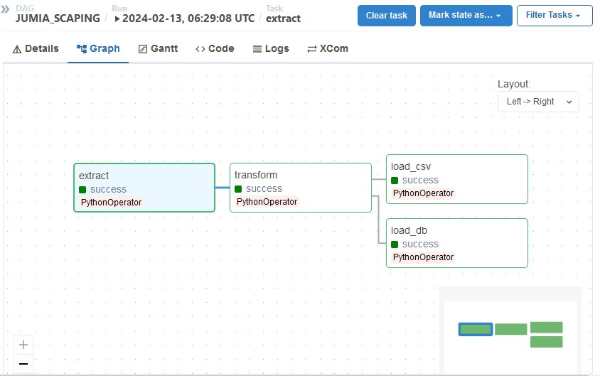
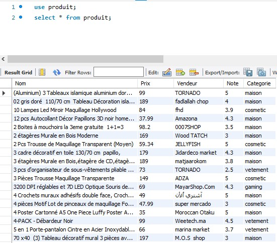
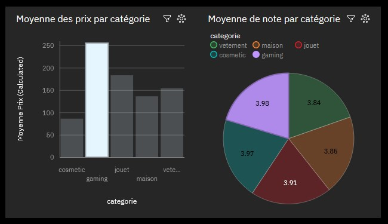

# Jumia Product Dashboard

## Table of Contents
* [General Info](#general-information)
* [Technologies Used](#technologies-used)
* [Screenshots](#screenshots)
<!-- * [License](#license) -->

## General Information
The pipeline systematically gathers data from the Jumia website through web scraping, capturing crucial details like product names, prices, ratings, and seller information. Subsequently, this raw data undergoes a transformation process before being loaded into both a MySQL database and a CSV file. Airflow plays a pivotal role in orchestrating the entire ETL (Extract, Transform, Load) pipeline. As a final step, the data stored in the CSV file serves as the foundation for creating a dashboard
<!-- You don't have to answer all the questions - just the ones relevant to your project. -->

## Technologies Used
- Python
- Airflow

## Screenshots

<!-- If you have screenshots you'd like to share, include them here. -->

<!-- Optional -->
<!-- ## License -->
<!-- This project is open source and available under the [... License](). -->

<!-- You don't have to include all sections - just the one's relevant to your project -->
